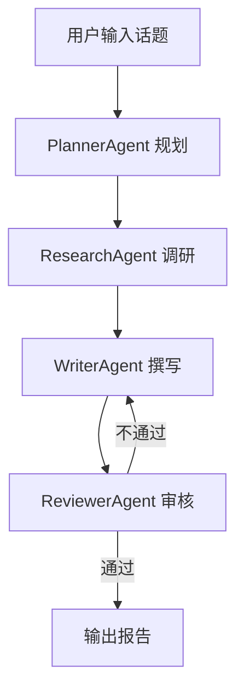

# 智能调研 Agent

> 输入一个话题，系统自动通过多 Agent 协作完成搜索、整理、生成研究报告。

## 项目简介

**智能调研 Agent** 是一个基于多 Agent 协作的自动化调研系统。用户只需提供一个调研话题，系统会自动：

1. **规划**：将话题拆解为多个调研维度和子任务
2. **调研**：通过搜索引擎和网页抓取收集相关信息
3. **撰写**：将调研发现整合成结构化的 Markdown 研究报告
4. **审核**：对报告进行质量评审，不合格则自动修订

## 架构图



```
用户输入
  │
  ▼
┌─────────────────────────────────────────┐
│           LangGraph WorkFlow            │
│                                         │
│  [plan] → [research] → [write] → [review]
│                           ▲         │  │
│                           └─revise──┘  │
│                                    passed
└─────────────────────────────────────────┘
  │
  ▼
输出 Markdown 报告
```

## 技术栈

| 技术 | 用途 |
|------|------|
| **多 Agent 协作** | Planner / Researcher / Writer / Reviewer 四个专职 Agent |
| **ReAct 推理模式** | Agent 基类实现 Thought→Action→Observation 推理循环 |
| **MCP 协议** | 统一工具调用协议，支持 Web Search / Browser / FileSystem |
| **LangGraph** | StateGraph 编排多 Agent 工作流，支持循环与条件分支 |
| **Skills 技能模块** | 可复用的搜索、抓取、摘要、分析技能 |
| **LangChain** | LLM 调用、消息管理、工具绑定 |
| **Tavily** | 搜索 API |

## 安装与使用

### 1. 安装依赖

```bash
pip install -e ".[dev]"
```

### 2. 配置环境变量

```bash
cp .env.example .env
# 编辑 .env 填入你的 API Key
```

### 3. 运行

```bash
# 标准调研
python main.py --topic "大模型应用现状"

# 快速调研
python main.py --topic "量子计算" --depth quick

# 深度调研，自定义输出路径
python main.py --topic "碳中和技术路径" --depth deep --output output/carbon.md
```

### 4. 运行测试

```bash
pytest tests/ -v
```

## 目录结构

```
research-agent/
├── main.py                        # 主入口
├── pyproject.toml                 # 依赖与项目元信息
├── .env.example                   # 环境变量模板
│
├── config/
│   └── settings.py                # 全局配置（LLM、搜索API、MCP等）
│
├── agents/                        # 多 Agent 定义
│   ├── base_agent.py              # Agent 基类（ReAct 循环实现）
│   ├── planner_agent.py           # 规划 Agent
│   ├── research_agent.py          # 调研 Agent
│   ├── writer_agent.py            # 撰写 Agent
│   └── reviewer_agent.py          # 审核 Agent
│
├── skills/                        # 可复用技能模块
│   ├── search_skill.py            # 搜索技能
│   ├── scrape_skill.py            # 网页抓取技能
│   ├── summarize_skill.py         # 摘要技能
│   └── analyze_skill.py           # 分析技能
│
├── mcp/                           # MCP 协议层
│   ├── mcp_client.py              # MCP 客户端
│   └── servers/                   # MCP Server 配置
│
├── graph/                         # LangGraph 工作流编排
│   ├── state.py                   # 全局状态定义
│   └── workflow.py                # StateGraph 工作流
│
├── memory/
│   └── research_memory.py         # 调研过程记忆
│
├── prompts/                       # Prompt 模板集中管理
│
├── output/                        # 报告输出目录
│
└── tests/                         # 测试
```

## 核心设计要点

### 1. ReAct 推理循环（`agents/base_agent.py`）

所有 Agent 继承 `BaseAgent`，内置 ReAct 循环：
- **Thought**：LLM 分析任务，决定下一步行动
- **Action**：调用对应的 Skill 工具
- **Observation**：获取工具结果，继续推理
- 循环直到 LLM 不再调用工具（给出最终答案）

### 2. LangGraph 工作流（`graph/workflow.py`）

使用 `StateGraph` 编排 4 个节点：
- `plan` → `research` → `write` → `review`
- `review` 节点通过条件边决定：通过则结束，不通过则回到 `write` 修订

### 3. MCP 协议（`mcp/mcp_client.py`）

`MCPClient` 统一管理多个 MCP Server 连接，Skills 可以透明地通过 MCP 或直接 API 调用工具。

### 4. Skills 技能模块

每个 Skill 实现两个接口：
- `as_tool()` → 返回 LangChain `@tool` 对象，用于 LLM 工具绑定
- `execute(**kwargs)` → 直接调用技能逻辑

## 使用示例

```python
import asyncio
from dotenv import load_dotenv
from config.settings import Settings
from graph.workflow import ResearchWorkflow

async def run():
    load_dotenv()
    settings = Settings()
    workflow = ResearchWorkflow(settings)
    report = await workflow.run(
        topic="生成式AI在教育领域的应用",
        depth="standard",
        output_path="output/ai_education.md",
    )
    print(f"报告已生成，共 {report.word_count} 字")

asyncio.run(run())
```
